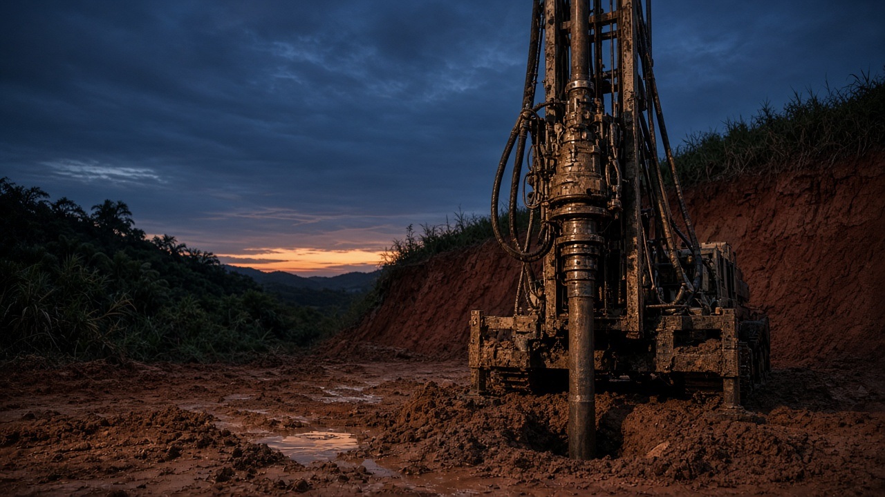

<p align="center">
  
</p>

<h1 align="center">TRIUNE Geotechnical Testing Services</h1>

<p align="center">
  <strong>Building Foundations of Trust Through Engineering Excellence</strong>
</p>

<p align="center">
  Official website for a DPWH-accredited geotechnical laboratory and engineering practice in Zamboanga City.
</p>

<p align="center">
  <a href="https://triunegeotech.netlify.app"><strong>Live website</strong></a>
  &nbsp;·&nbsp;
  <a href="https://github.com/phpmikeanz/triunegeotech">Source</a>
</p>

<p align="center">
  
  
  
</p>

---

## Practice

TRIUNE provides geotechnical investigations, deep foundation systems, and structural engineering for construction and infrastructure projects across Mindanao and Luzon. Reports are signed and sealed by PRC-licensed Geotechnical and Structural Engineers.

| Registration | Detail |
| --- | --- |
| **DTI** | No. 7095256 |
| **BIR** | TIN 730-831-143-00000 |
| **DPWH** | Accredited laboratory — legal acceptance for regulatory requirements and building permits |
| **Local** | Mayor’s Permit, Zamboanga City |

Testing and engineering work follow **ASTM**, **DPWH**, and **NSCP** requirements.

---

## Services

- **Geotechnical investigations** — soil boring, sampling, and Standard Penetration Testing (SPT)
- **Deep foundation systems** — bored piling and micro-piling
- **Structural engineering** — analysis, design, and evaluation
- **Soil and material testing** — laboratory procedures for quality control
- **Surveying** — site support for engineering and construction work

---

## Office

**Lot 5 Block 3, La Vina Drive Triplet, Santo Niño, 7000 Zamboanga City**

| | |
| --- | --- |
| Phone | [+63 962 778 5674](tel:+639627785674) |
| Email | [triunegeotechnical@gmail.com](mailto:triunegeotechnical@gmail.com) |
| Monday – Friday | 7:30 AM – 5:30 PM |
| Saturday | 7:30 AM – 12:00 NN |
| Sunday / Holidays | By appointment only |

---

## Stack

| Layer | Choice |
| --- | --- |
| Framework | Next.js 16 |
| UI | React 19 |
| Styling | Tailwind CSS 4 |
| Type | TypeScript |
| Hosting | Netlify |

The site is a single-page company profile: hero, credentials, services, projects, fieldwork, FAQ, and inquiry form. Light and dark themes are supported. Layouts are built for phone, tablet, and desktop.

---

## Local development

```bash
npm install
npm run dev
```

Open [http://localhost:3000](http://localhost:3000).

```bash
npm run build
npm start
```

---

## Repository

Private company facts in this repo match the public website only. Do not invent project counts, years of operation, or extra accreditations.

© 2026 TRIUNE Geotechnical Testing Services. All rights reserved.
